<p align="center">
  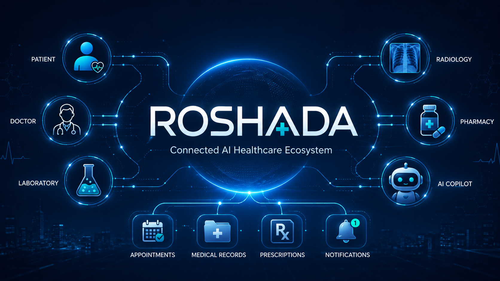
</p>

# Roshada

> A connected healthcare platform where patients, doctors, radiology centers and
> pharmacies share one set of appointments, records and prescriptions — with an
> AI assistant that answers from the platform's own data and from an approved
> medical knowledge base, never from guesswork.

<p align="center">
  
  
  
  
  
  
  
  
</p>

---

## Table of contents

- [Overview](#overview)
- [The problem](#the-problem)
- [The solution](#the-solution)
- [Features by role](#features-by-role)
- [Connected healthcare ecosystem](#connected-healthcare-ecosystem)
- [Screenshots](#screenshots)
- [System architecture](#system-architecture)
- [Patient architecture](#patient-architecture)
- [Doctor architecture](#doctor-architecture)
- [Laboratory architecture](#laboratory-architecture)
- [Radiology architecture](#radiology-architecture)
- [Pharmacy architecture](#pharmacy-architecture)
- [Appointment architecture](#appointment-architecture)
- [Notification architecture](#notification-architecture)
- [AI copilot architecture](#ai-copilot-architecture)
- [RAG architecture](#rag-architecture)
- [AI agent and tool calling](#ai-agent-and-tool-calling)
- [Database architecture](#database-architecture)
- [Authentication and RBAC](#authentication-and-rbac)
- [Healthcare data flow](#healthcare-data-flow)
- [Technology stack](#technology-stack)
- [Project structure](#project-structure)
- [Installation](#installation)
- [Environment variables](#environment-variables)
- [Deployment](#deployment)
- [Security](#security)
- [AI safety](#ai-safety)
- [Bilingual support](#bilingual-support)
- [Testing](#testing)
- [Production readiness](#production-readiness)
- [Roadmap](#roadmap)
- [License](#license)

---

## Overview

Roshada is a Django REST backend with a Streamlit portal, built around one idea:
the people involved in a course of care should be looking at the same record.

Six roles share one platform — **patient, doctor, laboratory, radiology centre,
pharmacy, administrator**. They do not each get a separate system that has to be
reconciled later. A doctor writes a prescription and the patient sees it; the
patient asks which pharmacy stocks it and gets a real answer from real inventory;
a radiology centre releases a report and the patient's medical record shows it
the moment it is released, not before.

On top of that sits an AI assistant that is deliberately narrow. It answers
general medical questions **only** from an approved, human-reviewed knowledge
base, with citations. It answers questions about your own record by calling the
same backend services your own pages call, as you, with your permissions. It
cannot reach the database directly, and it cannot book or cancel anything
without you agreeing first.

---

## The problem

A single course of care usually crosses four organisations. A patient sees a
doctor, is sent for imaging, collects medication from a pharmacy, and returns for
a follow-up. Each step typically lives in a different system — or on paper.

The consequences are ordinary and constant:

- The patient carries the information between providers, usually from memory.
- A doctor prescribing has no view of whether the medication is obtainable nearby.
- A released radiology report reaches the patient only when someone remembers.
- Nobody has one view of the patient's history, so it gets reconstructed at every visit.

The failure is not that any one system is bad. It is that none of them are
connected, so the coordination work falls on the person least equipped to do it.

---

## The solution

One platform, one database, one set of shared services.

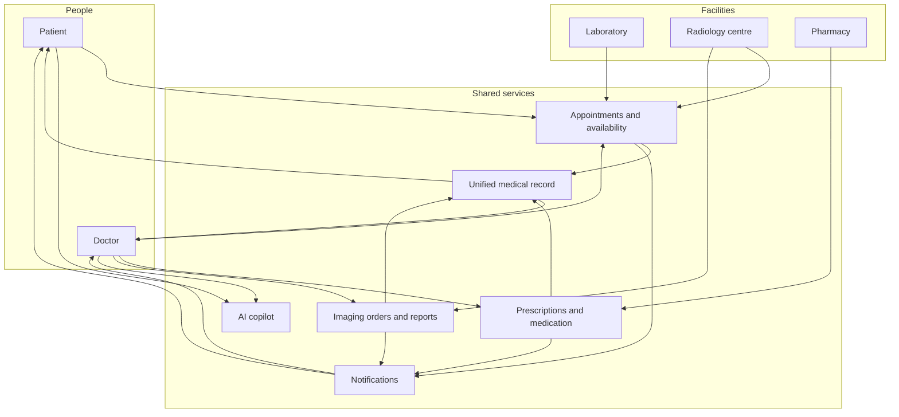

A booking, a prescription and a report are each written once and read by everyone
entitled to see them. What each role may see is decided by the backend, never by
the interface.

---

## Features by role

Only implemented capabilities are listed. Items marked *placeholder* have a page
in the portal that says plainly that the feature is not built, rather than
showing an empty screen that could be mistaken for "you have no records".

### Patient

- Book appointments with doctors, laboratories and radiology centres
- Search providers and see real bookable slots
- View, cancel and reschedule their own appointments
- View radiology reports — released ones only
- View prescriptions issued to them, with medicines and instructions
- Search which pharmacies stock a medication, with price and availability
- Request medication from a pharmacy and track the request through to collection
- Unified medical record: one timeline of appointments, imaging and prescriptions
- Message their treating doctors
- In-app notifications
- AI assistant with knowledge-base grounding and tool access to their own data
- Egyptian National-ID OCR to auto-fill signup details

### Doctor

- Publish availability rules, services and time off
- See their own schedule and daily appointment counts
- Set an appointment outcome (completed / no-show)
- Write and issue prescriptions for patients they treat
- Raise radiology orders and track them to the released report
- Read the unified medical record of patients they treat
- Message their patients
- In-app notifications
- AI assistant with tool access to their own practice
- *Placeholder:* Patients directory, Consultations, Lab Orders

### Laboratory

- Register as a facility and publish a test catalogue
- Publish availability and accept patient bookings
- In-app notifications
- *Placeholder:* Orders, Samples, Results

Laboratory is **partially implemented**: it participates fully in the
appointment system, but there is no lab-order or lab-result pipeline. The AI
tool for lab results says so explicitly rather than returning an empty list.

### Radiology centre

- Publish imaging services, modalities and availability
- Accept doctor-raised orders and patient self-bookings
- Move an examination through scheduled → checked in → in progress → completed
- Attach imaging files to an examination
- Author reports and move them through draft → pending review → verified → released
- In-app notifications

### Pharmacy

- Maintain a medication catalogue and per-pharmacy inventory with price and stock
- Answer availability searches from patients
- Receive medication requests and move them through the fulfilment states
- Stock is reserved on confirmation and released on cancellation, under database constraints
- Read prescriptions only to the extent needed to fill them
- In-app notifications

### Administrator

- Platform dashboard: user, appointment and facility counts
- Directories of users, doctors, patients, laboratories, radiology centres and pharmacies
- Medical knowledge base: add sources, review and approve them, ingest and re-index documents
- Retrieval testing and index status
- Published permission matrix
- *Placeholder:* Reports, Audit logs, System settings

---

## Connected healthcare ecosystem

Workflows that exist end to end in the code:

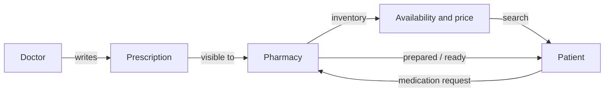

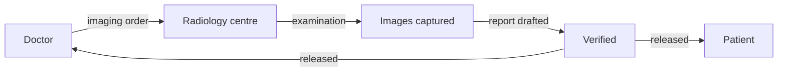

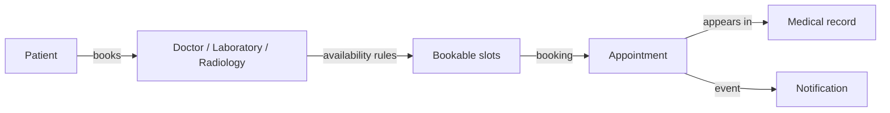

The laboratory result workflow is **not implemented**. A laboratory can be
booked, but there is no path from a lab order to a released result.

---

## Screenshots

Screenshots are not included in this README yet.

The portal runs locally with the commands in [Installation](#installation);
every page listed under [Features by role](#features-by-role) is reachable from
the sidebar after signing in with the matching role.

---

## System architecture

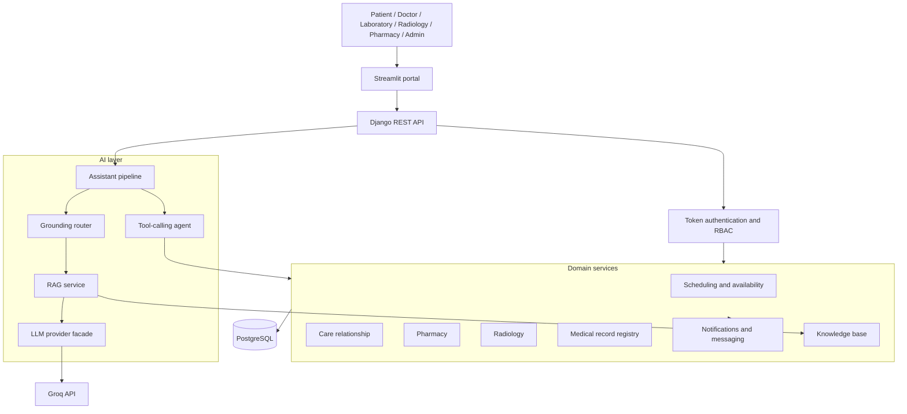

Three properties are load-bearing:

- The **AI layer never touches the database.** It reaches data only by calling a
  domain service through a tool, as the authenticated user.
- **Notifications are raised by domain services**, through callback registries,
  so no clinical module imports the notification module.
- **PostgreSQL is the only database.** There is no SQLite fallback; the
  application will not start without a reachable server.

---

## Patient architecture

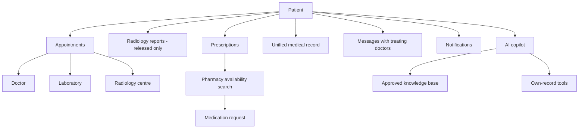

---

## Doctor architecture

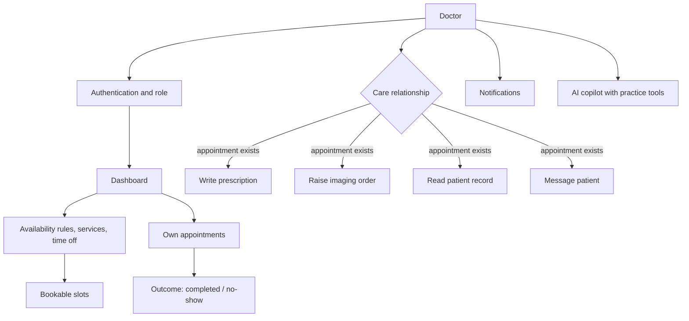

A doctor reaches a patient's clinical data only when a **care relationship**
exists — an appointment between the two. That one rule gates prescribing,
imaging orders, record access and messaging, and lives in a single module so the
four cannot drift apart.

---

## Laboratory architecture

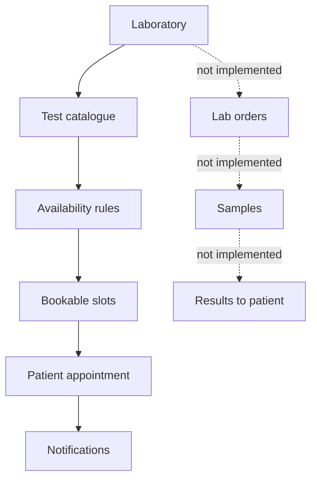

Solid arrows are implemented. Dotted arrows are not built.

---

## Radiology architecture

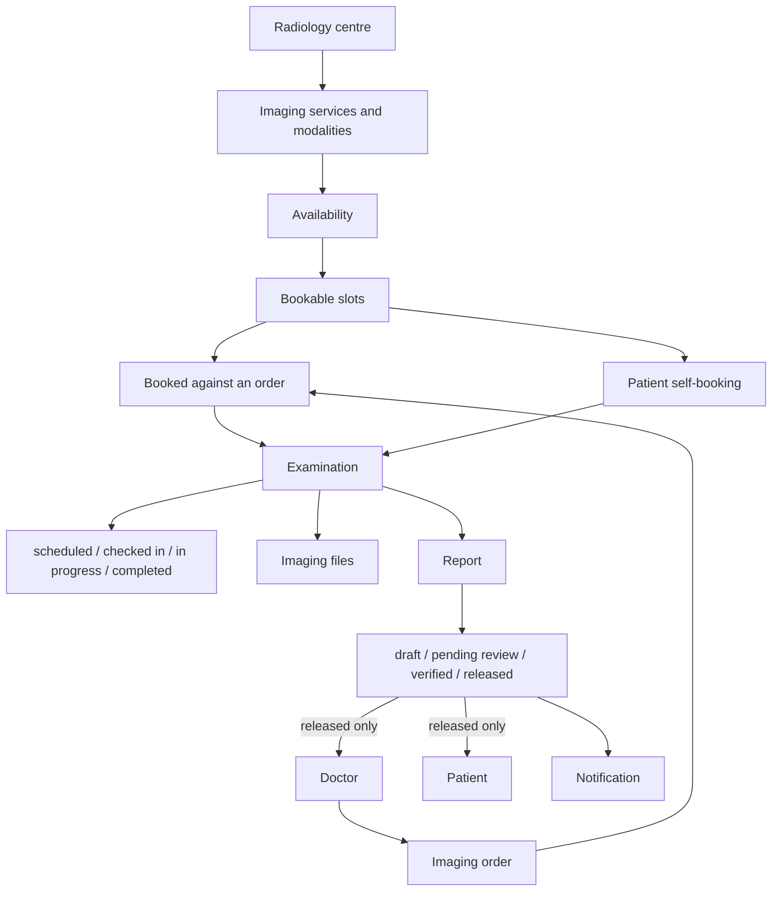

A report is a clinical document only once released. Drafts notify nobody and are
invisible to the patient.

---

## Pharmacy architecture

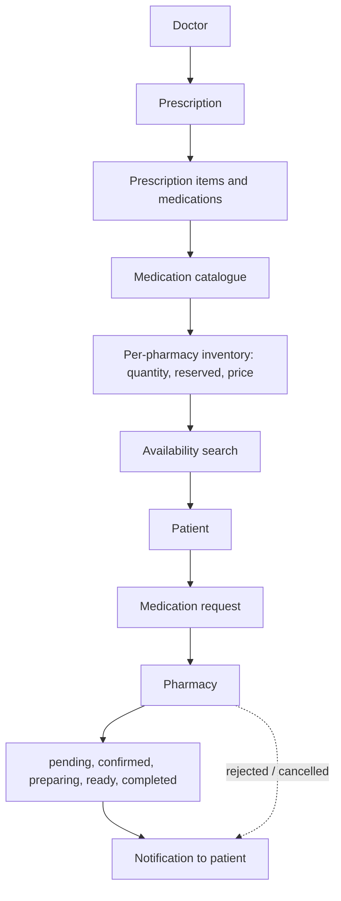

Stock is reserved when a request is confirmed and released when it is cancelled,
enforced by database constraints rather than by application checks alone.

---

## Appointment architecture

One appointment model serves all three bookable provider kinds — doctor,
laboratory and radiology centre.

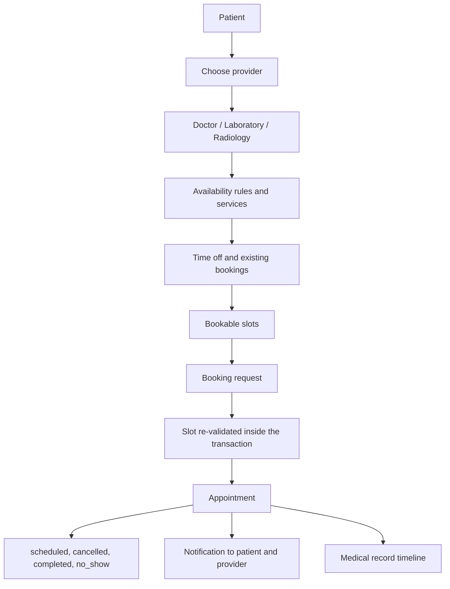

Whatever slots a client last saw, the slot is recomputed inside the booking
transaction, and overlapping appointments for one provider are prevented by a
database exclusion constraint.

---

## Notification architecture

Notifications are **event-based, immediate and synchronous** — raised in-process
by the domain service that caused them, inside a savepoint so a failed
notification can never roll back the clinical action that triggered it. There is
no message queue and no background worker.

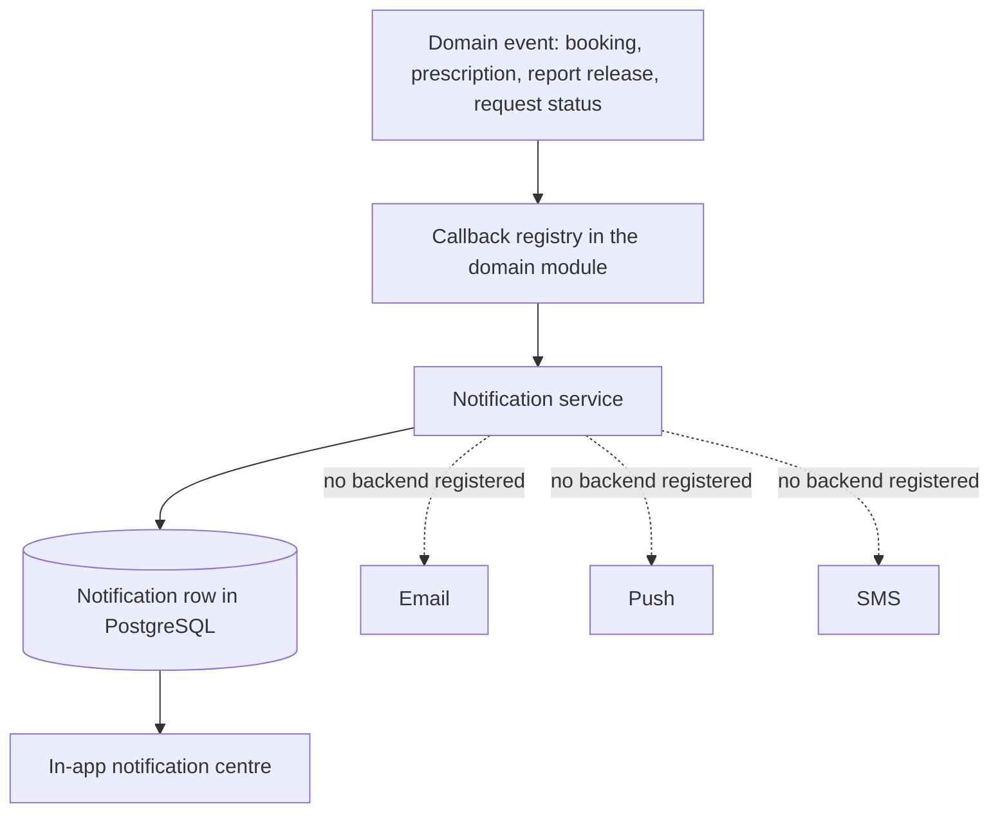

**Channels.** In-app is the only delivery channel that exists. Email, push and
SMS are *named* in the channel registry so a future integration is a single
registration, but no backend is registered for any of them, and the registry
reports honestly which channels are live. **Telegram is not implemented and
appears nowhere in the codebase.**

The one scheduled piece is a `send_appointment_reminders` management command,
intended to be run by an external scheduler such as cron. It is not wired to a
task queue.

### Notification data flow

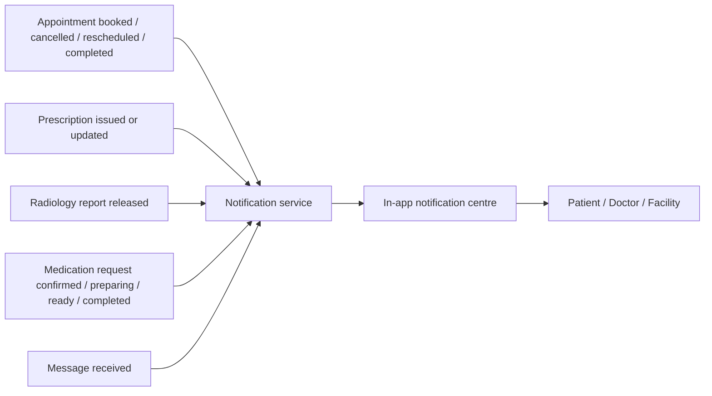

Twenty notification types are defined. `lab_result_released` is defined but has
no producer, because the laboratory results pipeline is not built.

Notification bodies deliberately carry **no clinical content** — a notification
says a report was released, not what it says.

---

## AI copilot architecture

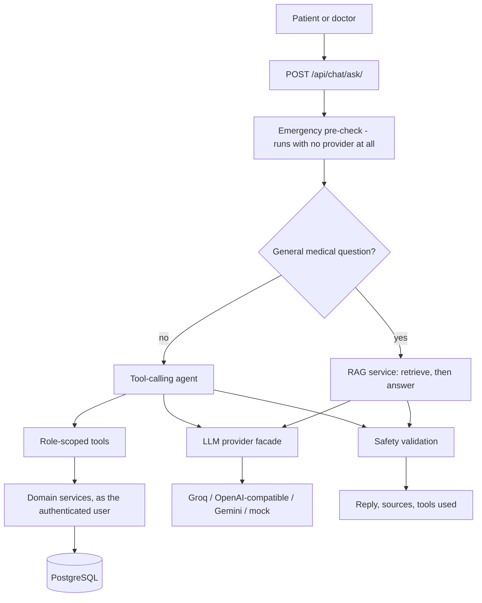

**The language model never reaches PostgreSQL.** It can request a named tool;
the backend decides whether that tool exists for the caller's role, injects the
authenticated user itself, and runs the same service the user's own pages call.
The model has no way to name a different user.

The provider is chosen by configuration. Swapping Groq for a local model is a
`.env` change; no application code names a vendor.

---

## RAG architecture

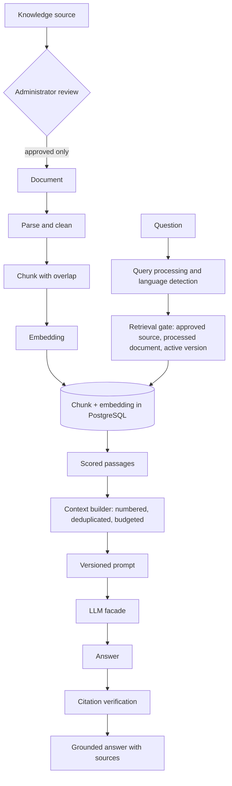

Verified properties:

- **No context means no model call.** If the corpus returns nothing relevant, the
  model is never invoked and a fixed refusal is returned.
- **Citations are checked against what was actually sent.** A citation number the
  application never provided is reported as fabricated, and the answer is marked
  degraded rather than silently edited.
- **Retrieval scores are reported as retrieval relevance, never as medical confidence.**
- Only **approved** sources, **processed** documents and **active** versions are retrievable.

**Vector storage.** Embeddings are stored as raw float32 bytes in a PostgreSQL
column and compared by brute-force cosine similarity. There is no `pgvector`,
Chroma, FAISS, Pinecone or external vector database — and no LangChain or
LlamaIndex. An offline hashing embedder is used when no embedding credential is
configured, so retrieval and the test suite work with no external service.

---

## AI agent and tool calling

Fourteen tools exist, scoped by role. Facility roles hold none.

| Role | Tools |
|---|---|
| Patient | `search_doctors`, `get_doctor_availability`, `search_availability`, `search_pharmacy_availability`, `get_patient_appointments`, `get_patient_prescriptions`, `get_patient_radiology_reports`, `get_patient_lab_results`, `book_appointment`, `cancel_appointment` |
| Doctor | `get_doctor_appointments`, `get_doctor_schedule`, `search_doctor_patient_appointments`, `get_doctor_patients` |

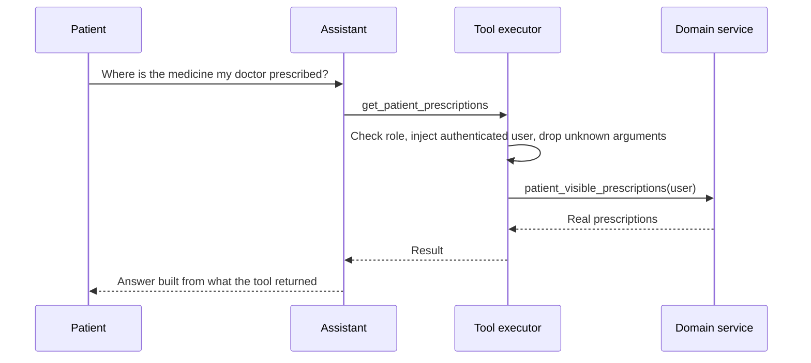

**No tool schema contains an identifier for a person** — no `patient_id`, no
`user_id`, no `username`. A patient cannot ask about another patient because the
question cannot be expressed, and a doctor's patient search runs only over
patients they already treat, returning the same answer for "no such person" and
"not your patient" so existence is never leaked.

### Booking requires agreement

Write tools are gated across two turns:

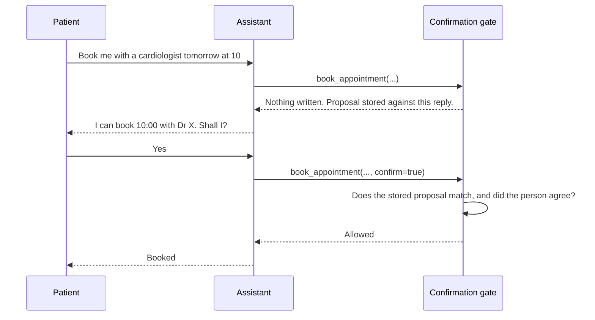

The proposal must come from an **earlier** turn, so there is always a message
from the person in between — and that message is what the gate reads. Agreement
to one appointment cannot execute a different one, or a cancellation, because
the tool name and every argument are compared against what was proposed.
Imperatives like "book it" are deliberately not treated as confirmation.

---

## Database architecture

PostgreSQL, through the Django ORM. Entities below are taken from the actual
models.

```mermaid
erDiagram
    USER ||--|| USERACCOUNT : "has role"
    USER ||--o| PATIENTPROFILE : "patient"
    USER ||--o| DOCTOR : "doctor"
    USER ||--o| LABORATORYPROFILE : "laboratory"
    USER ||--o| RADIOLOGYPROFILE : "radiology"
    USER ||--o| PHARMACYPROFILE : "pharmacy"

    USER ||--o{ SERVICE : "offers"
    USER ||--o{ AVAILABILITYRULE : "publishes"
    USER ||--o{ TIMEOFF : "blocks"
    USER ||--o{ APPOINTMENT : "books as patient"
    USER ||--o{ APPOINTMENT : "hosts as provider"
    SERVICE ||--o{ APPOINTMENT : "booked as"

    USER ||--o{ PRESCRIPTION : "issues as doctor"
    USER ||--o{ PRESCRIPTION : "receives as patient"
    PRESCRIPTION ||--|{ PRESCRIPTIONITEM : contains
    MEDICATION ||--o{ PRESCRIPTIONITEM : "prescribed as"
    MEDICATION ||--o{ PHARMACYINVENTORY : "stocked as"
    USER ||--o{ PHARMACYINVENTORY : "held by pharmacy"
    USER ||--o{ MEDICATIONREQUEST : "raised by patient"
    USER ||--o{ MEDICATIONREQUEST : "filled by pharmacy"
    PRESCRIPTION ||--o{ MEDICATIONREQUEST : "requested from"
    MEDICATIONREQUEST ||--|{ MEDICATIONREQUESTITEM : contains

    USER ||--o{ IMAGINGORDER : "ordered by doctor"
    USER ||--o{ IMAGINGORDER : "for patient"
    IMAGINGORDER ||--o{ EXAMINATION : "fulfilled by"
    APPOINTMENT ||--o| EXAMINATION : "is"
    EXAMINATION ||--o{ IMAGINGFILE : "produces"
    EXAMINATION ||--o| RADIOLOGYREPORT : "reported in"

    USER ||--o| MEDICALRECORD : "registry for patient"
    USER ||--o{ NOTIFICATION : receives
    USER ||--o{ CONVERSATION : "patient side"
    USER ||--o{ CONVERSATION : "doctor side"
    CONVERSATION ||--|{ MESSAGE : contains
    USER ||--o{ CHATMESSAGE : "AI conversation"

    KNOWLEDGESOURCE ||--o{ DOCUMENT : publishes
    DOCUMENT ||--|{ DOCUMENTCHUNK : "chunked into"
    DOCUMENT ||--o| DOCUMENT : supersedes
```

The relationships that matter most:

- **One appointment model, three provider kinds.** `provider` is a `User`, whose
  role decides whether it is a doctor, a laboratory or a radiology centre. There
  is no separate booking table per facility type.
- **`MedicalRecord` stores no clinical data.** It is a per-patient registry; the
  timeline is assembled at read time from appointments, imaging and pharmacy, so
  the record can never disagree with its sources.
- **`Appointment` and `Examination` are one-to-one** when imaging is booked, so a
  scan is an appointment rather than a parallel scheduling system.
- **Chunks record which vector space they belong to** (embedder, model,
  dimension), so an index built with one embedder cannot be queried with another
  and return confident nonsense.

---

## Authentication and RBAC

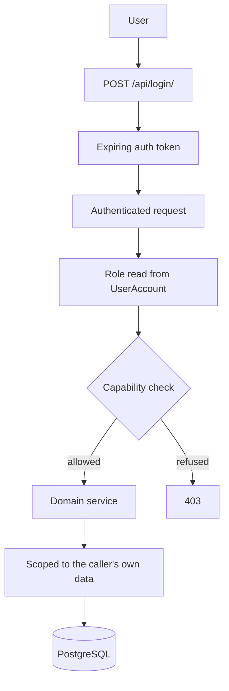

Six roles: **patient, doctor, laboratory, radiology, pharmacy, admin.**
Administrators cannot be created through public signup.

Views ask for a *capability*, not a role, and the matrix lives in one module that
the API, the tests and the admin permissions screen all read — so the published
matrix and the enforced one cannot disagree. Tokens expire on a configurable TTL
and rotate on the next successful login. Login and signup are throttled
separately from ordinary reads, and AI questions get their own tighter budget
because each one is a billable third-party call.

---

## Healthcare data flow

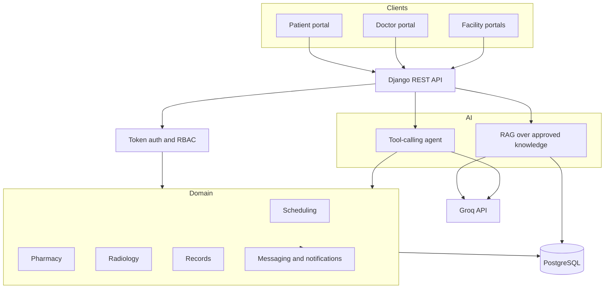

The only outbound network dependency in normal operation is the configured LLM
provider. Retrieval, embeddings and every clinical workflow run against the
application's own database.

---

## Technology stack

| Layer | Technology |
|---|---|
| Frontend | Streamlit (single-page portal, custom design system) |
| Backend | Django 5.2 |
| API | Django REST Framework 3.15 |
| Database | PostgreSQL (required; no SQLite fallback) |
| ORM | Django ORM, with database-level constraints |
| Authentication | DRF token authentication with expiry, custom class |
| Authorization | Role and capability matrix in `accounts/roles.py` |
| LLM | Groq (`openai/gpt-oss-20b` by default), reached over HTTP |
| LLM alternatives | Any OpenAI-compatible endpoint, Google Gemini, offline mock |
| RAG | Built in-repo: chunking, embeddings, retrieval, context building |
| Vector storage | float32 bytes in PostgreSQL, brute-force cosine |
| Embeddings | OpenAI-compatible API embedder, or offline hashing embedder |
| Notifications | In-app only, event-based and synchronous |
| Email / SMS / Push / Telegram | Not implemented |
| OCR | Tesseract and a YOLO detector for Egyptian National-ID fields |
| Charts | Plotly |
| Tests | pytest, pytest-django |
| Containerisation | Dockerfile and docker-compose (API, portal, PostgreSQL) |

No provider SDK is used. Every LLM and embedding provider is reached over its
HTTP API through one adapter layer that shares a single retry, timeout and error
policy.

---

## Project structure

```
Roshada/
├── config/                  Django project: settings, URLs, WSGI/ASGI
├── accounts/                Roles, profiles, signup, login, permission matrix
├── appointments/            Scheduling engine and the AI service layer
│   ├── services/
│   │   ├── scheduling.py    Booking, cancelling, rescheduling, outcomes
│   │   ├── availability.py  Rules, time off, slot generation, validation
│   │   ├── care.py          The care-relationship rule shared by four modules
│   │   ├── chat.py          AI conversation history and pending proposals
│   │   ├── rag/             Retrieval engine: parse, chunk, embed, store, search
│   │   └── ai/
│   │       ├── pipeline.py  One entry point for an assistant turn
│   │       ├── grounding.py Routes a question to knowledge or to tools
│   │       ├── agent.py     Bounded tool-calling loop
│   │       ├── tools/       Role-scoped tools and the confirmation gate
│   │       ├── prompts/     Versioned prompt library (Markdown with frontmatter)
│   │       └── providers/   Groq, OpenAI-compatible, Gemini, mock
│   └── management/commands/ ai_check, rag_check, agent_check, rag_ingest
├── pharmacy/                Medications, prescriptions, inventory, requests
├── radiology/               Orders, examinations, imaging files, reports
├── records/                 Unified medical record as a source registry
├── comms/                   Notifications, channels, conversations, messaging
├── knowledge/               Governed medical knowledge base and RAG pipeline
├── shared/                  Frontend helpers: API client, theme, safety copy
├── tests/                   1132 tests across 20 modules
├── assets/                  Logos, favicons, README hero image
├── streamlit_app.py         The portal
├── ocr_processor.py         National-ID OCR
├── Dockerfile               Single image serving both API and portal
└── docker-compose.yml       API, portal and PostgreSQL
```

---

## Installation

Requires **Python 3.10 or newer** and a running **PostgreSQL** server. The
Docker image uses Python 3.11; the test suite is run on 3.10.

```bash
# 1. Clone
git clone <repository-url>
cd Roshada

# 2. Create and activate a virtual environment
python -m venv .venv
# Windows
.venv\Scripts\activate
# macOS / Linux
source .venv/bin/activate

# 3. Install dependencies
pip install -r requirements.txt
pip install -r requirements-dev.txt   # only if you intend to run the tests

# 4. Create the database
psql -U postgres -c "CREATE DATABASE roshada;"

# 5. Configure the environment
cp .env.example .env
# then edit .env — at minimum DB_PASSWORD, DJANGO_SECRET_KEY and GROQ_API_KEY

# 6. Apply migrations
python manage.py migrate

# 7. Create an administrator (needed for the knowledge base)
python manage.py createsuperuser
```

Run the two processes in separate terminals:

```bash
# Backend API
python manage.py runserver            # http://127.0.0.1:8000

# Streamlit portal
streamlit run streamlit_app.py        # http://localhost:8501
```

No separate AI service is required — the assistant runs inside the Django
process. Verify the AI stack:

```bash
python manage.py ai_check                          # provider reachable
python manage.py ai_check --provider mock          # works with no credentials
python manage.py rag_check "What is hypertension?" # retrieval and grounding
python manage.py agent_check <username> --tools-only
```

Populate the knowledge base before expecting grounded answers — add and approve a
source in the admin portal, then ingest documents there or with
`python manage.py rag_ingest`.

Email and Telegram require no configuration because neither is implemented.

### Docker

```bash
cp .env.example .env      # fill in the values
docker compose up --build
```

Compose starts PostgreSQL, the API on port 8000 and the portal on port 8501.

---

## Environment variables

Copy `.env.example` to `.env`. It documents every variable the application
reads; the essentials are below. Placeholders only — never commit real values.

| Variable | Purpose |
|---|---|
| `DJANGO_SECRET_KEY` | Django signing key. Generate a long random value. |
| `DJANGO_DEBUG` | `False` in production. |
| `DJANGO_ALLOWED_HOSTS` | Comma-separated hostnames the API may serve. |
| `DJANGO_CSRF_TRUSTED_ORIGINS` | Comma-separated https origins, for production. |
| `DB_NAME`, `DB_USER`, `DB_PASSWORD`, `DB_HOST`, `DB_PORT` | PostgreSQL connection. |
| `AUTH_TOKEN_TTL_HOURS` | Auth-token lifetime. |
| `AI_PROVIDER` | `groq`, `openai`, `gemini`, `local`, `mock` or `auto`. |
| `GROQ_API_KEY`, `GROQ_MODEL` | Groq credentials and model id. |
| `AI_GROUNDING` | `auto`, `on` or `off` — knowledge-base grounding. |
| `AI_TOOLS` | `on` or `off` — tool calling. |
| `RAG_EMBEDDER` | `auto`, `api` or `hashing`. |
| `API_BASE_URL` | Where the portal reaches the API. |

The AI keys are read **only** by the Django process. The Streamlit portal never
reads a provider credential; it talks to the API, which holds the key
server-side.

---

## Deployment

Roshada is **not currently deployed anywhere**. What exists is a container setup
and production-aware settings.

```mermaid
graph TB
    subgraph Local["Local development"]
        LD[runserver on 8000]
        LS[streamlit on 8501]
        LP[(Local PostgreSQL)]
        LD --- LP
        LS --> LD
    end
    subgraph Container["Docker Compose"]
        CA[API service - gunicorn]
        CU[Portal service - streamlit]
        CP[(PostgreSQL service)]
        CA --- CP
        CU --> CA
    end
    EXT[Groq API]
    LD --> EXT
    CA --> EXT
```

For a production deployment:

- Set `DJANGO_DEBUG=False`, a strong `DJANGO_SECRET_KEY`, real
  `DJANGO_ALLOWED_HOSTS` and `DJANGO_CSRF_TRUSTED_ORIGINS`.
- `DB_PASSWORD` is mandatory once debug is off.
- Serve the API with the bundled gunicorn command; put TLS in front of it.
- Point `API_BASE_URL` at the API's public origin.
- Uploaded imaging and ingested documents are written under `media/`, which is
  git-ignored — mount it on durable storage.
- Provide `GROQ_API_KEY` through the environment, never in the image.
- Run `python manage.py migrate` on release.
- Optionally schedule `python manage.py send_appointment_reminders` with cron.

---

## Security

- **Token authentication with expiry.** Tokens older than the configured TTL are
  rejected and rotated on the next successful login.
- **Role-based access control**, with a single capability matrix read by the API,
  the tests and the admin screen.
- **Patient data isolation.** Every read is scoped to the caller. A patient
  cannot address another patient's data; a doctor reaches only patients they
  have a care relationship with.
- **Minimum necessary disclosure.** A pharmacy filling a prescription sees the
  lines it must fill and enough reference to verify the prescription is real — no
  diagnosis, no prescriber notes, no other medications.
- **Released-only clinical documents.** Draft radiology reports are invisible to
  patients and notify nobody.
- **Server-side credentials.** Provider API keys live in the API process
  environment. The portal never receives one, and error paths are tested to
  confirm keys never appear in responses or logs.
- **Throttling** per scope, with a tighter budget for AI endpoints.
- **Database-level guarantees**: an exclusion constraint prevents overlapping
  appointments; check constraints prevent overselling pharmacy stock.
- **Notifications carry no clinical content.**
- No secrets in the repository; `.env` is git-ignored and `.env.example` holds
  placeholders only.

---

## AI safety

- **The assistant is not a doctor and does not diagnose or prescribe.** A safety
  fragment is included in every model-facing prompt, and a validation layer runs
  over every answer.
- **The language model cannot reach PostgreSQL, execute SQL, or run code.** It
  can only request a named tool; the backend decides whether the caller may use
  it and injects the user identity itself.
- **General medical answers are grounded in approved sources.** Only
  administrator-approved sources, processed documents and active versions are
  retrievable. With no relevant context the model is not called at all, and a
  fixed refusal is returned.
- **Citations are verified.** A source number the application never supplied is
  reported as fabricated and the answer is marked degraded, not quietly edited.
- **Retrieval scores are never presented as medical confidence.**
- **Answers that state a specific dose, or read like a prescription or diagnosis,
  are flagged**; unusable answers are rejected outright.
- **Emergency detection runs before and independently of the provider**, so a
  red-flag message gets a seek-care notice even when the AI is unavailable.
- **Nothing is booked or cancelled without explicit agreement** from the person,
  in a later message, matched against the exact action proposed.
- **Grounded answers read no patient data**, and patient-specific answers use no
  knowledge-base content; the two paths never share context.

---

## Bilingual support

The platform is used in Arabic and English.

- The assistant answers in the language of the question — Arabic in, Arabic out —
  instructed by the shared prompt library and verified against the live provider.
- Retrieval handles both scripts: Arabic text is normalised during cleaning, and
  the offline embedder tokenises Arabic as readily as English.
- Mixed Arabic and English questions are handled in one turn.
- The AI tools understand Arabic date words such as "today" and "tomorrow", and
  the confirmation gate recognises agreement and refusal in both languages.
- National-ID OCR converts Arabic-Indic digits and reshapes Arabic text.

The portal interface itself is English; per-page right-to-left layout switching
is **not implemented**.

---

## Testing

```bash
pytest                       # the whole suite
pytest tests/test_ai_tools.py -v
```

**1132 tests, all passing**, across 20 modules. The suite runs against a real
PostgreSQL test database — never SQLite — so it exercises the same constraints
production relies on.

| Area | Covered by |
|---|---|
| Scheduling and availability | `test_scheduling_engine.py` |
| Roles and authorization | `test_roles_and_authorization.py` |
| Pharmacy, including concurrency on stock | `test_pharmacy.py` |
| Radiology workflow and report release | `test_radiology.py` |
| Unified medical record | `test_medical_records.py` |
| Notifications and messaging | `test_communications.py` |
| Knowledge base and governance | `test_knowledge_base.py` |
| Retrieval engine | `test_rag.py` |
| RAG pipeline and grounding | `test_rag_pipeline.py`, `test_rag_groq_integration.py` |
| LLM providers and the Groq adapter | `test_llm_providers.py`, `test_groq_provider.py` |
| AI tools, authorization and the confirmation gate | `test_ai_tools.py` |
| Assistant pipeline and safety | `test_ai_assistant.py` |
| Prompt library | `test_prompts.py` |
| API regressions and frontend client | `test_api_regressions.py`, `test_frontend_api_client.py`, `test_unit_regressions.py` |

No test requires an API key. The offline mock provider and hashing embedder make
the AI and retrieval paths fully testable without credentials.

---

## Production readiness

| Area | Status |
|---|---|
| Authentication | Implemented |
| RBAC | Implemented |
| PostgreSQL | Implemented |
| Appointments and availability | Implemented |
| Laboratory | Partially Implemented — appointments and catalogue only; no orders, samples or results |
| Radiology | Implemented |
| Pharmacy | Implemented |
| Prescriptions | Implemented |
| Medical records | Implemented |
| Messaging | Implemented |
| Notifications (in-app) | Implemented |
| Email | Not Implemented |
| Telegram | Not Implemented |
| SMS / Push | Not Implemented |
| AI copilot | Implemented |
| RAG | Implemented |
| Tool calling | Implemented |
| National-ID OCR | Implemented |
| Testing | Implemented |
| Deployment | Partially Implemented — container setup exists; not deployed |
| Audit logging | Not Implemented |
| Reporting and exports | Not Implemented |

---

## Roadmap

Future work. None of the following is implemented today.

- **Laboratory pipeline** — lab orders, sample tracking and released results, to
  match the radiology workflow.
- **Email notifications** — one channel registration; the notification service
  already routes through a channel registry.
- **Consultation notes** — a first-class consultation record, so the medical
  record timeline stops inferring one from appointments.
- **Audit logging** — a queryable trail of who read and changed what.
- **Approximate-nearest-neighbour retrieval** — the corpus is scanned
  exhaustively today, which is fine at the current scale and will not stay so.
- **Conversation-aware grounding** — the grounded path currently sees only the
  current message, so a follow-up question loses its referent.
- **Reporting and exports** for administrators.

---

## License

No license file is present in this repository. Without one, default copyright
applies and no permissions are granted for reuse. Add a `LICENSE` file before
publishing if you intend the project to be used by others.

---

## Medical disclaimer

Roshada is a demonstration platform. It is **not a medical device**, and nothing
it produces — including any AI answer — is a diagnosis, a treatment decision, or
a substitute for a qualified clinician.
