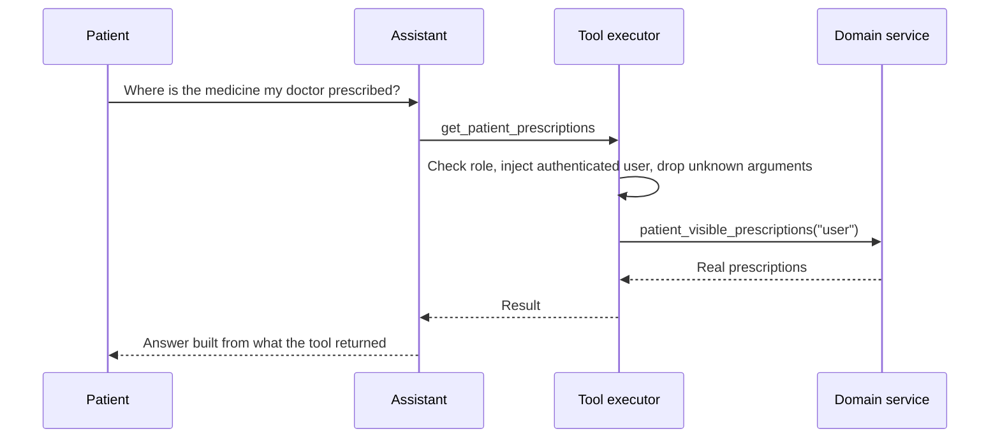
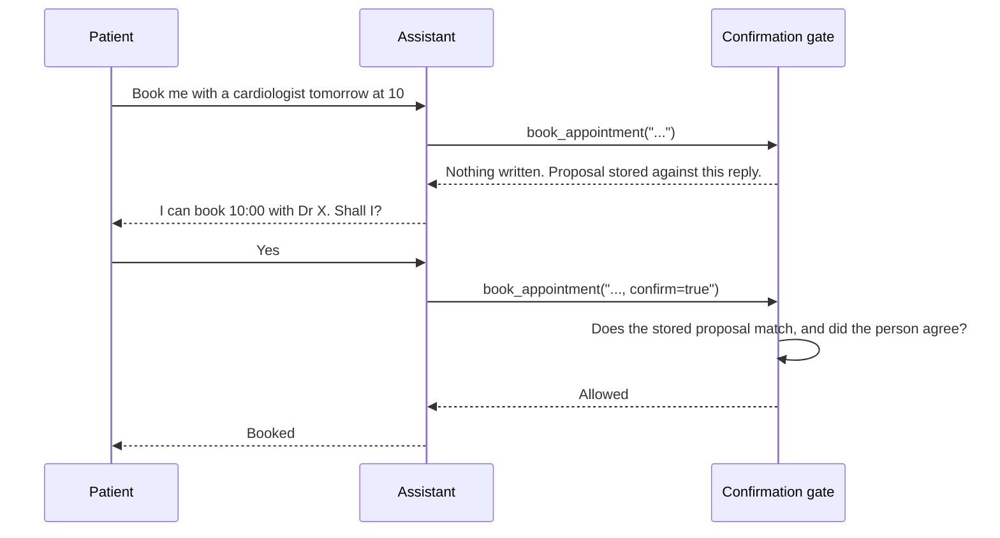

# AI agent and tool calling

How the assistant selects a tool, and the two-turn gate that must pass
before anything is written.

[Back to the project README](../../README.md)

## AI agent and tool calling

## Booking requires agreement

