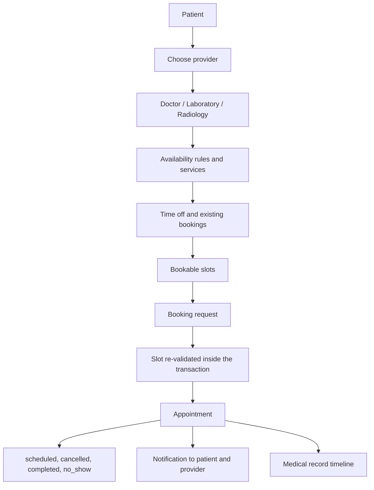

# Appointment workflow

One booking engine serving doctors, laboratories and radiology centres.

[Back to the project README](../../README.md)

```mermaid
flowchart TD
    U["Patient"] --> PICK["Choose provider"]
    PICK --> PR["Doctor / Laboratory / Radiology"]
    PR --> RULES["Availability rules and services"]
    RULES --> BLOCK["Time off and existing bookings"]
    BLOCK --> SLOTS["Bookable slots"]
    SLOTS --> BOOK["Booking request"]
    BOOK --> VALID["Slot re-validated inside the transaction"]
    VALID --> AP["Appointment"]
    AP --> ST["scheduled, cancelled, completed, no_show"]
    AP --> N["Notification to patient and provider"]
    AP --> REC["Medical record timeline"]
```
