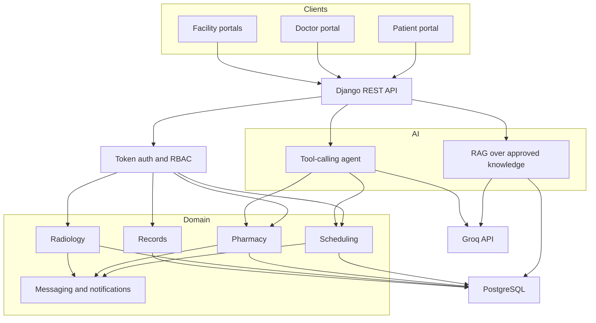

# Healthcare data flow

How information moves between clients, services, the database and the AI layer.

[Back to the project README](../../README.md)

```mermaid
flowchart TB
    subgraph Clients
        PU["Patient portal"]
        DU["Doctor portal"]
        FU["Facility portals"]
    end
    API["Django REST API"]
    AUTH["Token auth and RBAC"]
    subgraph Domain
        S1["Scheduling"]
        S2["Pharmacy"]
        S3["Radiology"]
        S4["Records"]
        S5["Messaging and notifications"]
    end
    DB["PostgreSQL"]
    subgraph AI
        RAGS["RAG over approved knowledge"]
        AGENTS["Tool-calling agent"]
    end
    EXT["Groq API"]

    PU --> API
    DU --> API
    FU --> API
    API --> AUTH
    AUTH --> S1
    AUTH --> S2
    AUTH --> S3
    AUTH --> S4
    S1 --> DB
    S2 --> DB
    S3 --> DB
    S4 --> DB
    S1 --> S5
    S2 --> S5
    S3 --> S5
    API --> RAGS
    API --> AGENTS
    AGENTS --> S1
    AGENTS --> S2
    RAGS --> DB
    RAGS --> EXT
    AGENTS --> EXT
```
