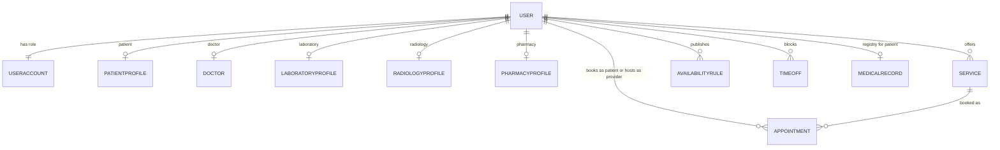
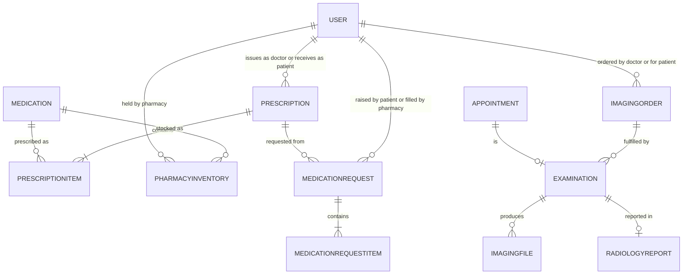
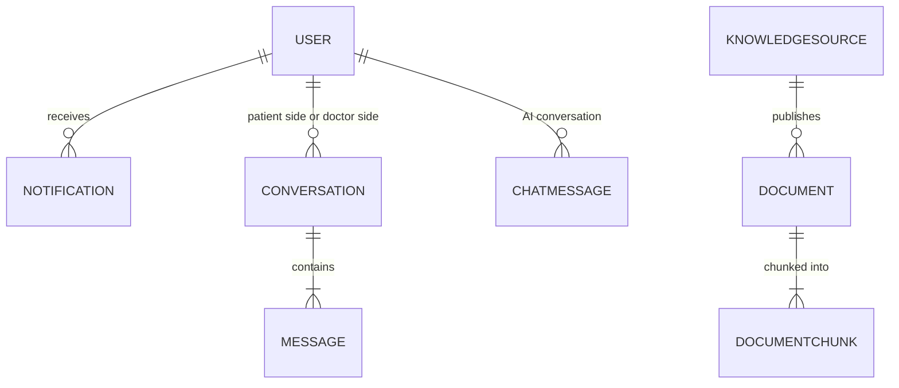

# Database schema

The PostgreSQL entities and relationships, taken from the Django models.

[Back to the project README](../../README.md)

## Database architecture

## Database architecture

## Database architecture

