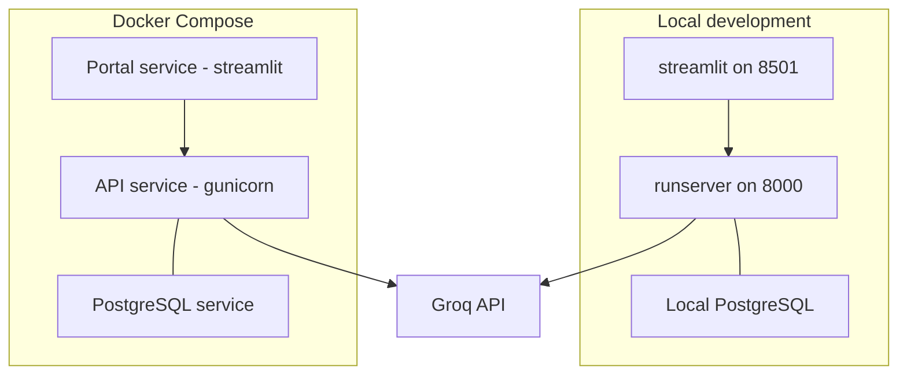

# Deployment architecture

Local development and the container setup.

[Back to the project README](../../README.md)

```mermaid
flowchart TB
    subgraph Local["Local development"]
        LD["runserver on 8000"]
        LS["streamlit on 8501"]
        LP["Local PostgreSQL"]
        LD --- LP
        LS --> LD
    end
    subgraph Container["Docker Compose"]
        CA["API service - gunicorn"]
        CU["Portal service - streamlit"]
        CP["PostgreSQL service"]
        CA --- CP
        CU --> CA
    end
    EXT["Groq API"]
    LD --> EXT
    CA --> EXT
```
