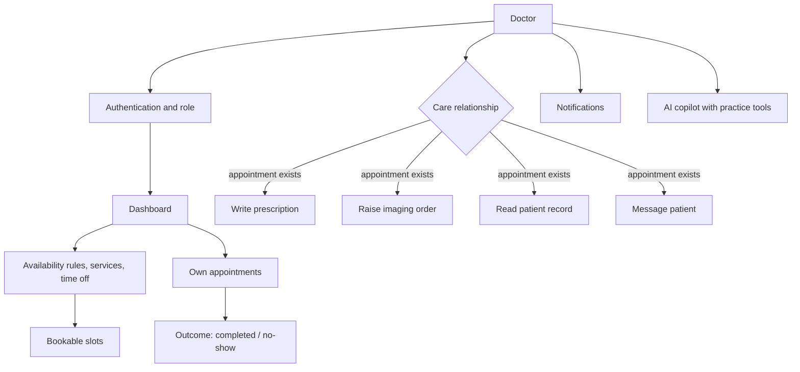

# Doctor workflow

A doctor's practice, and the care-relationship rule that gates it.

[Back to the project README](../../README.md)

```mermaid
flowchart TD
    D["Doctor"] --> AUTH["Authentication and role"]
    AUTH --> DASH["Dashboard"]
    DASH --> AVAIL["Availability rules, services, time off"]
    AVAIL --> SLOTS["Bookable slots"]
    DASH --> APPTS["Own appointments"]
    APPTS --> OUT["Outcome: completed / no-show"]
    D --> CARE{"Care relationship"}
    CARE -->|appointment exists| RX["Write prescription"]
    CARE -->|appointment exists| IMG["Raise imaging order"]
    CARE -->|appointment exists| REC["Read patient record"]
    CARE -->|appointment exists| MSG["Message patient"]
    D --> N["Notifications"]
    D --> AI["AI copilot with practice tools"]
```
