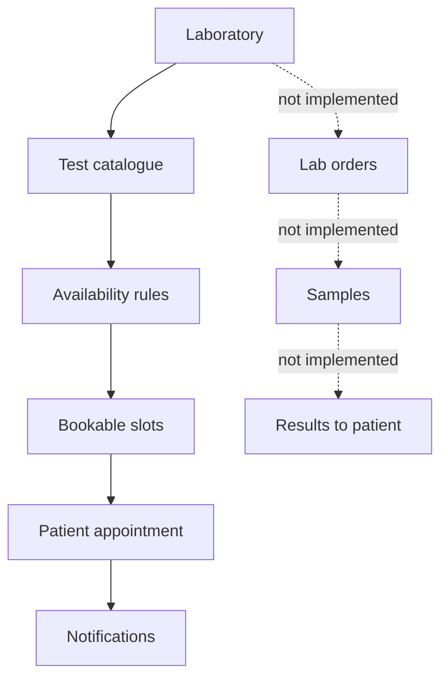

# Laboratory workflow

What the laboratory role does today, and what is not built.

[Back to the project README](../../README.md)

```mermaid
flowchart TD
    L["Laboratory"] --> SVC["Test catalogue"]
    SVC --> AV["Availability rules"]
    AV --> SL["Bookable slots"]
    SL --> AP["Patient appointment"]
    AP --> N["Notifications"]
    L -.not implemented.-> ORD["Lab orders"]
    ORD -.not implemented.-> SAM["Samples"]
    SAM -.not implemented.-> RES["Results to patient"]
```
