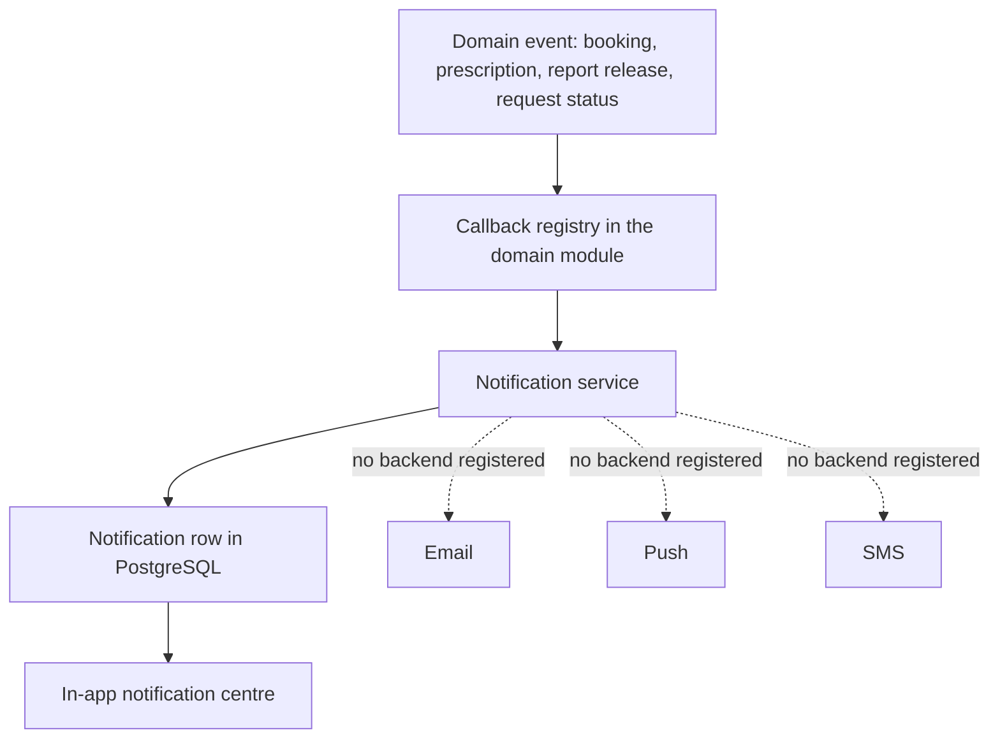
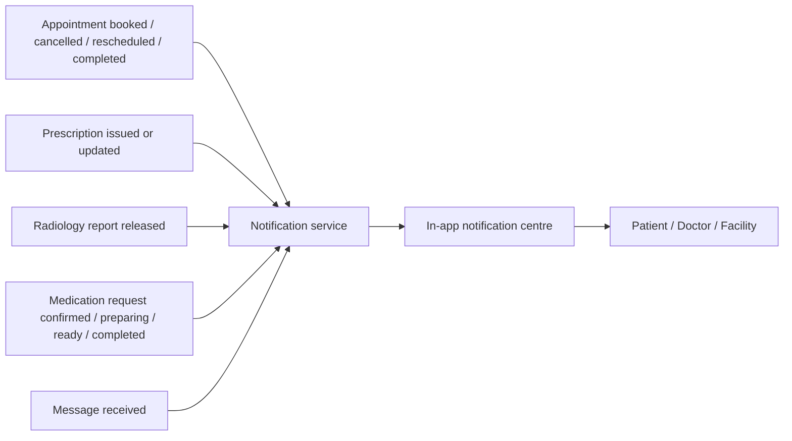

# Notification architecture

How a domain event becomes a notification, and which channels exist.

[Back to the project README](../../README.md)

## Notification architecture

## Notification data flow

