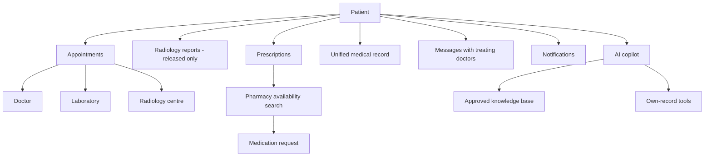

# Patient workflow

What a patient can reach in Roshada, and how those paths connect.

[Back to the project README](../../README.md)

```mermaid
flowchart TD
    P["Patient"]
    P --> A["Appointments"]
    A --> AD["Doctor"]
    A --> AL["Laboratory"]
    A --> AR["Radiology centre"]
    P --> RR["Radiology reports - released only"]
    P --> RX["Prescriptions"]
    RX --> PS["Pharmacy availability search"]
    PS --> MR["Medication request"]
    P --> REC["Unified medical record"]
    P --> MSG["Messages with treating doctors"]
    P --> N["Notifications"]
    P --> AI["AI copilot"]
    AI --> KBQ["Approved knowledge base"]
    AI --> TOOLS["Own-record tools"]
```
