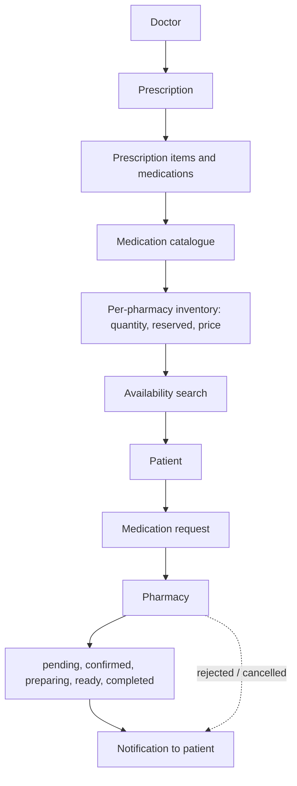

# Pharmacy workflow

Prescription to inventory to medication request.

[Back to the project README](../../README.md)

```mermaid
flowchart TD
    D["Doctor"] --> RX["Prescription"]
    RX --> ITEMS["Prescription items and medications"]
    ITEMS --> CAT["Medication catalogue"]
    CAT --> INV["Per-pharmacy inventory: quantity, reserved, price"]
    INV --> SEARCH["Availability search"]
    SEARCH --> PT["Patient"]
    PT --> REQ["Medication request"]
    REQ --> PH["Pharmacy"]
    PH --> FLOW["pending, confirmed, preparing, ready, completed"]
    FLOW --> N["Notification to patient"]
    PH -.rejected / cancelled.-> N
```
