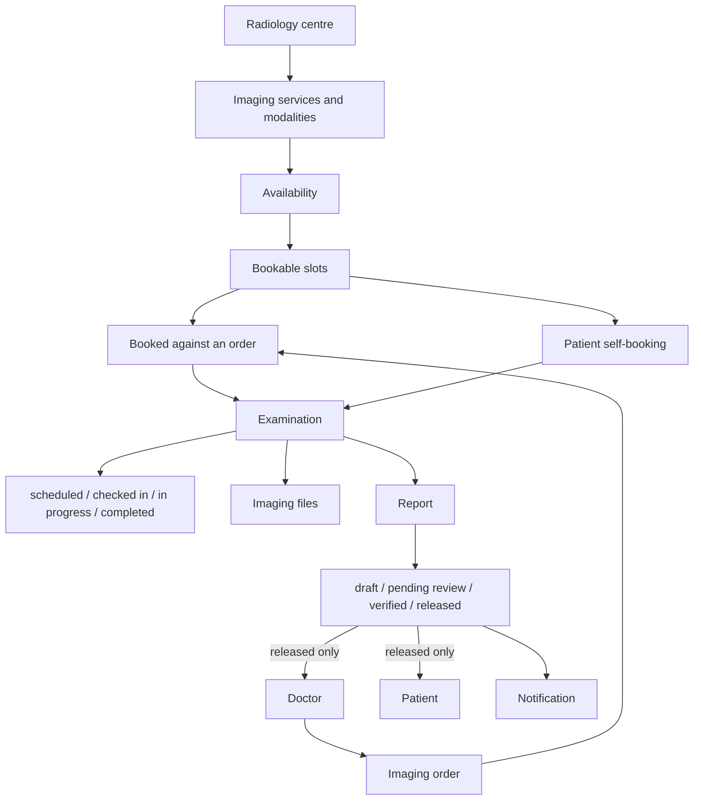

# Radiology workflow

Imaging orders through examination to a released report.

[Back to the project README](../../README.md)

```mermaid
flowchart TD
    R["Radiology centre"] --> SVC["Imaging services and modalities"]
    SVC --> AV["Availability"]
    AV --> SL["Bookable slots"]
    D["Doctor"] --> ORD["Imaging order"]
    ORD --> BK["Booked against an order"]
    SL --> BK
    SL --> SELF["Patient self-booking"]
    BK --> EX["Examination"]
    SELF --> EX
    EX --> ST["scheduled / checked in / in progress / completed"]
    EX --> FILES["Imaging files"]
    EX --> REP["Report"]
    REP --> RS["draft / pending review / verified / released"]
    RS -->|released only| PT["Patient"]
    RS -->|released only| D
    RS --> N["Notification"]
```
