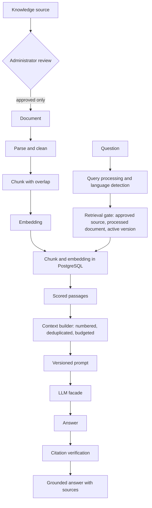

# RAG architecture

Ingestion, the retrieval gate, and grounded answering with citations.

[Back to the project README](../../README.md)

```mermaid
flowchart TD
    SRC["Knowledge source"] --> REVIEW{"Administrator review"}
    REVIEW -->|approved only| DOC["Document"]
    DOC --> PARSE["Parse and clean"]
    PARSE --> CHUNK["Chunk with overlap"]
    CHUNK --> EMB["Embedding"]
    EMB --> STORE["Chunk and embedding in PostgreSQL"]

    Q["Question"] --> PROC["Query processing and language detection"]
    PROC --> GATE["Retrieval gate: approved source, processed document, active version"]
    GATE --> STORE
    STORE --> HITS["Scored passages"]
    HITS --> CTX["Context builder: numbered, deduplicated, budgeted"]
    CTX --> PROMPT["Versioned prompt"]
    PROMPT --> LLM["LLM facade"]
    LLM --> ANS["Answer"]
    ANS --> CITE["Citation verification"]
    CITE --> OUT["Grounded answer with sources"]
```
