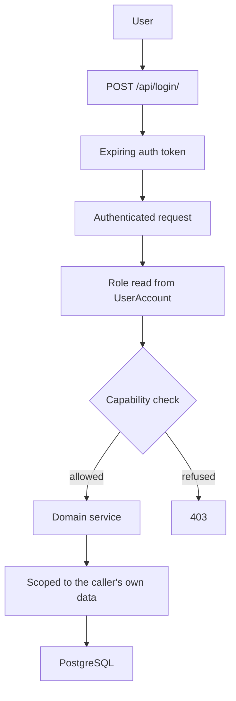

# Security architecture

Authentication, role resolution and capability-based authorization.

[Back to the project README](../../README.md)

```mermaid
flowchart TD
    U["User"] --> LOGIN["POST /api/login/"]
    LOGIN --> TOK["Expiring auth token"]
    TOK --> REQ["Authenticated request"]
    REQ --> ROLE["Role read from UserAccount"]
    ROLE --> CAP{"Capability check"}
    CAP -->|allowed| SVC["Domain service"]
    CAP -->|refused| DENY["403"]
    SVC --> SCOPE["Scoped to the caller's own data"]
    SCOPE --> DB["PostgreSQL"]
```
